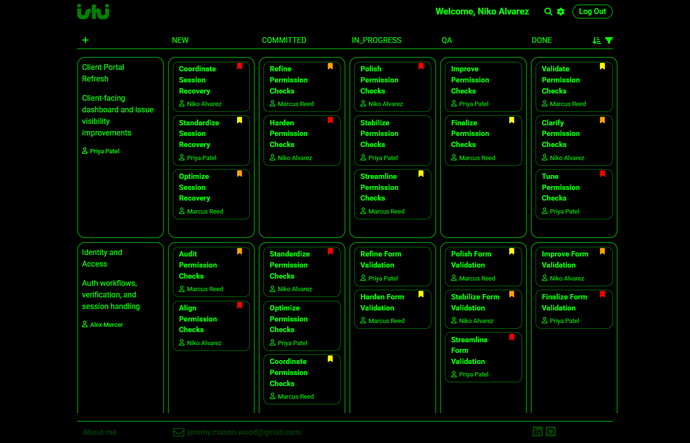
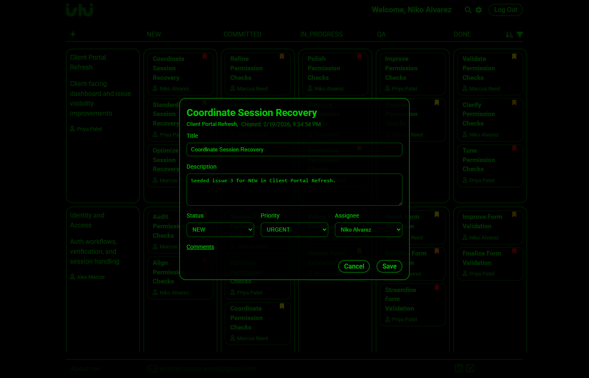
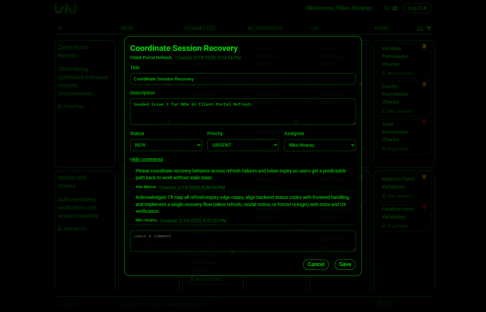

# Ishi Kanban

Ishi Kanban is a full-stack task management application built to demonstrate production-style engineering across frontend, backend, data, auth, and security.  
It supports role-aware workflows for admins, developers, and clients, with guarded CRUD behavior and polished modal-driven UX.

## Live Portfolio Demo (GitHub Pages)

- Interactive frontend demo: https://jeremymwood.github.io/250720-kanban-site/
- Runs in `VITE_DEMO_MODE=true` with seeded in-browser data (no backend dependency on Pages).
- Demo data resets to the original seed set on each page refresh.

### Demo Credentials

- Shared demo password: `Password123`
- Admin: `alex`
- Developers: `niko`, `priya`, `marcus`
- Clients: `claire`, `owen`, `maya`

## 30-Second Overview

- Built and shipped a full-stack Kanban platform with role-enforced workflows for Admin, Developer, and Client users.
- Implemented secure authentication with JWT access tokens, refresh-token rotation, email verification, and account activation gates.
- Delivered production-oriented reliability and security controls: rate limiting, strict CORS allowlist, Helmet headers, health checks, and request tracing.
- Designed a polished modal-first UX with drag/drop issue flow, search/sort/filter utilities, and permission-aware editing behavior.
- Strong readiness mindset: health probes, structured diagnostics, and release discipline.

## Project Scope

- Full-stack Kanban workflow with project lanes and issue lifecycle tracking.
- Role-based authorization model (`ADMIN`, `DEVELOPER`, `CLIENT`) enforced on the API.
- Session auth with access/refresh token flow and inactivity expiry on the client.
- Email verification and account activation pipeline for new users.
- Security baseline for deployment: rate limiting, hardened cookies, CORS allowlist, Helmet, readiness checks.

## Feature Highlights (Product View)

- **Role-based controls**
  - Admin: full project/issue/user management.
  - Developer: create/move/update assigned issues and collaborate through comments.
  - Client: prioritized visibility and scoped edit permissions.
- **Kanban workflows**
  - Drag-and-drop issue movement by status.
  - Filter/sort/search utilities for projects and issues.
  - Modal-based create/edit/delete flows with confirmations.
- **User/account management**
  - Account settings modal.
  - User activation/deactivation and role management (policy-bound by role).
- **Auth and verification**
  - Username login.
  - Verification + approval gating for new accounts.
  - Refresh token rotation and logout revocation.

## Architecture (Technical View)

- **Frontend**: React + TypeScript + Vite
- **Backend**: Node.js + Express + TypeScript
- **ORM/Data**: Prisma + PostgreSQL
- **Auth**: JWT access tokens + refresh tokens in HttpOnly cookie
- **Email/Verification**: Twilio Verify (email channel)
- **Deployment/Infra**: Railway (app + Postgres), Cloudflare (DNS/assets)

Request flow:

1. React client calls Express REST API.
2. API validates request, enforces role policy, and executes Prisma queries.
3. Postgres persists users/projects/issues/tokens.
4. Auth/session middleware returns signed access tokens and rotated refresh cookies.

## APIs and Integrations

- **Twilio Verify API**
  - Email verification code generation and validation.
- **Cloudflare**
  - Domain/DNS and hosted static image assets.
- **Railway**
  - Service and database hosting.

## Security and Reliability

- Redis-backed auth rate limits in production.
- CORS exact-origin allowlist (no wildcard in prod).
- Helmet security headers.
- Secure, HttpOnly, SameSite refresh cookie policy.
- Refresh-token rotation with revocation handling.
- Startup env validation (fail-fast for required secrets).
- Health endpoints:
  - `GET /health/live`
  - `GET /health/ready`
- Request tracing with `x-request-id` propagation in responses.
- Structured request/error logs for easier production diagnostics.
- Graceful shutdown handling with configurable timeout (`GRACEFUL_SHUTDOWN_TIMEOUT_MS`).

## Engineering Maturity

- Schema and data lifecycle are handled with Prisma migrations and controlled deployment scripts.
- Query indexes are designed for common high-traffic access patterns:
  - issue lane/filter queries (`projectId + status`, `projectId + priority`)
  - assignment lookups (`assigneeId`)
  - token/session cleanup and lookup (`userId`, `userId + revokedAt`, `expiresAt`)
  - ownership/list views (`ownerId`, `createdAt`, user role/active)
- Readiness checks include a live database probe (`/health/ready`) to reduce bad deploys.
- CI enforces consistent build/typecheck gates across frontend and backend.

## Role Outcomes (At a Glance)

- **Admin**: full control over users, projects, ownership, and issue lifecycle.
- **Developer**: can create and move issues, update assigned work, and collaborate via comments.
- **Client**: can monitor progress, participate in workflow where allowed, and influence priority.

## Screenshots

**Board View**  

**Issue Detail Modal**  

**Issue Discussion / Comments**  

## Next Improvements

- Add automated API integration tests for auth/session and role policies.
- Persist issue comments server-side with audit metadata.
- Add observability (structured logs + metrics dashboard).
- Expand CI quality gates (lint + integration test pipeline).
